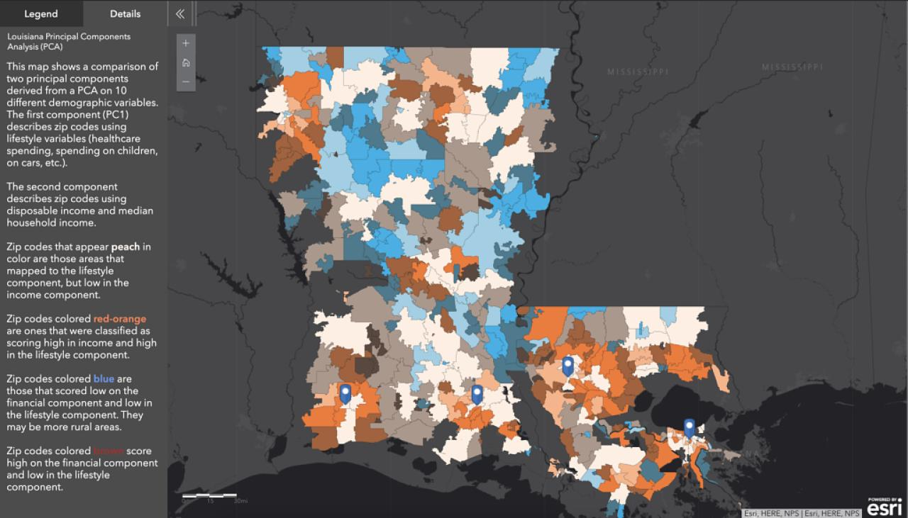
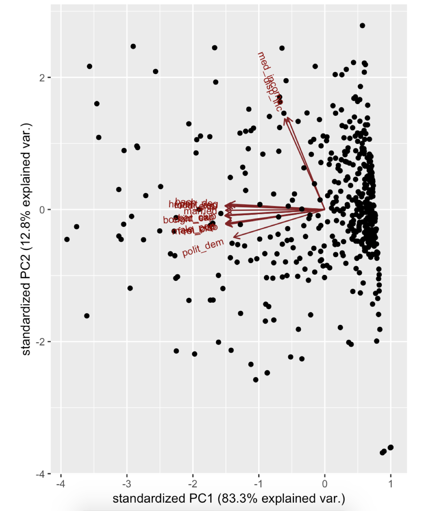

# Geodemographic Segmentation with Factor Analysis

Geodemographic segmentation involves segmenting geographic areas (such as postal codes, county boundaries, or census tracts) based on their underlying demographics using quantitative analysis. This project investigates how the demographics and spending behavior of attributes to postal codes in Louisiana can be segmented using dimensionality reduction techniques. The results of the analysis are shown on [this web map](https://bit.ly/3oHFy6O).

## Approach

The techniques used in the analysis are Principal Components Analysis (PCA), Factor Analysis (EFA) and Linear Discriminant Analysis (LDA). PCA and EFA are used to explore latent variables (psychographics) in the data, while LDA is used to classify postal codes as either predominantly liberal or conservative based on their underlying demographics as an additional experiment in predicting voter turnout.

## Findings

Given a set of demographic and consumer spending variables, the results of the analysis show that there are two distinct latent factors that can be used to describe the characteristics of each postal code; social livelihood and per-capita spending. We also found that urbanized areas score higher on both factors, while rural areas score low in both factors (see figure above).

